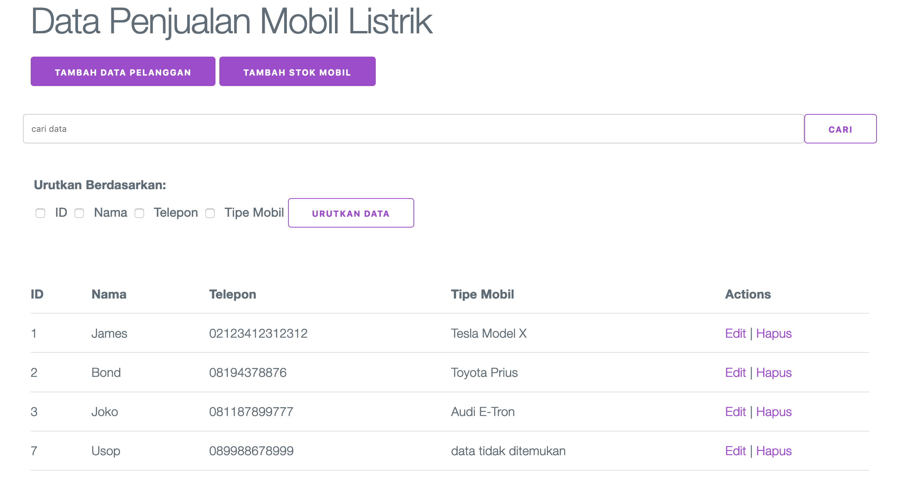
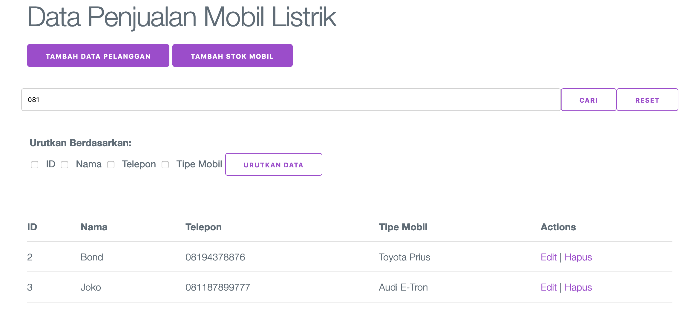
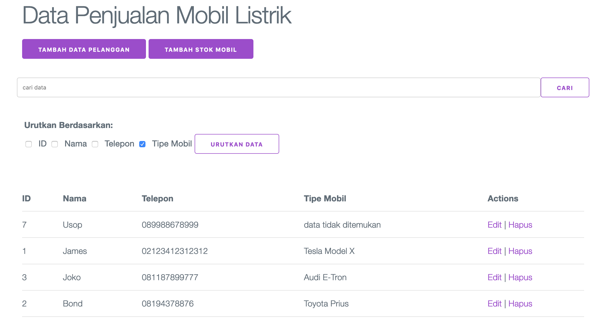
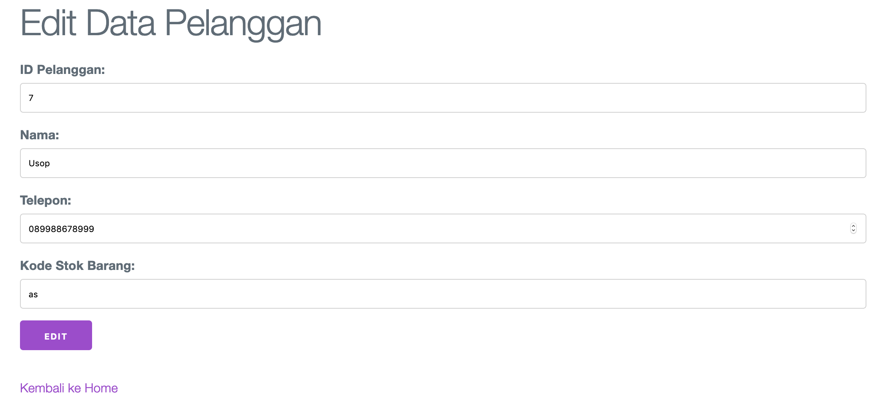
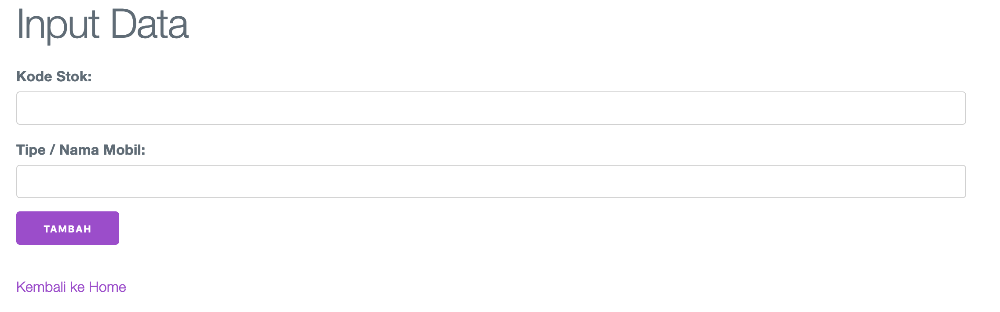

# programming language

Python 3
https://www.python.org/downloads/

# requirements

Flask (web framework)
https://flask.palletsprojects.com/en/1.1.x/installation/
`pip install Flask`

# run program

\$ export FLASK_APP=hello.py && export FLASK_ENV=development && flask run

open in web browser http://127.0.0.1:5000

# Demo program

## Homepage

## Searching

## Sort data

## Edit Customer Data

## Add Car Data

